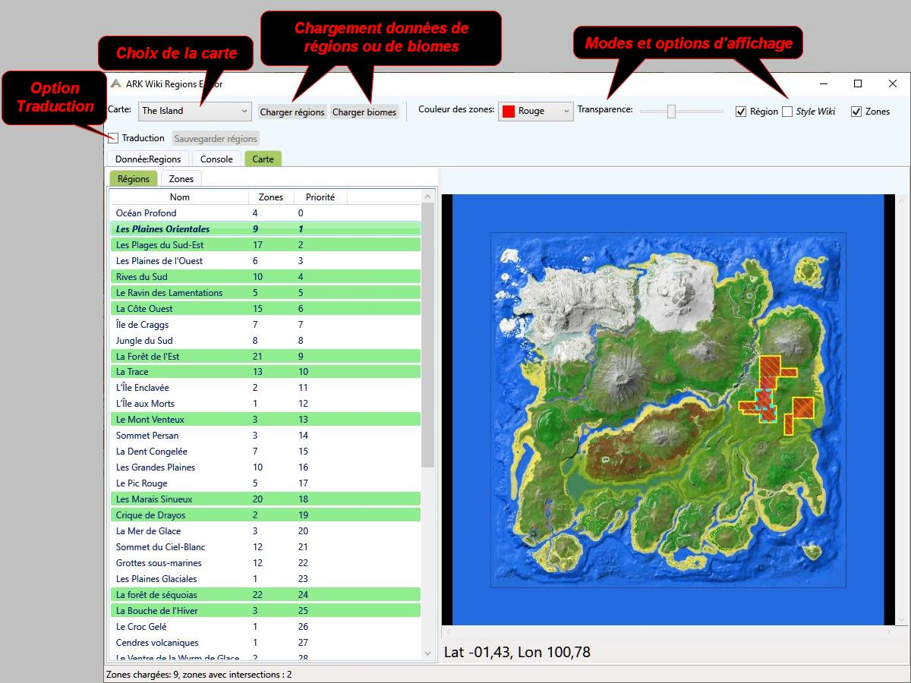

# ARK Wiki Regions Editor

Version 1.6.0 (17/08/2023)

Liste des cartes et données de régions intégrées:
- The Island
- Scorched Earth
- Aberration
- Extinction
- Genesis: Part 1
- Genesis: Part 2
- The Center
- Ragnarok
- Valguero
- Crystal Isles
- Lost Island
- Fjordu


## Introduction


'ARK Wiki Regions Editor' est une application de création et d'édition de données de régions pour le wiki du jeu ARK https://ark.wiki.gg.

Cette application fonctionne sous Windows et est Open Source.
https://github.com/gdfou/ARKWikiRegionsEditor.git


## Installation
Cette application nécessite .NET Framework 4.8:<br>
https://dotnet.microsoft.com/en-us/download/dotnet-framework/net48.

Elle ne nécessite pas de procédure d'installation particulière.
Télécharger le package `ARKWikiRegionsEditor_1_6_0.zip` à partir du Google Drive suivant:
https://drive.google.com/drive/folders/1e6z73Em_N_vAToUhHqyrhsRUxNAUhamI?usp=drive_link
<br>Et décompression là où vous voulez.


## Les régions sur le Wiki


Sur le Wiki les régions sont affichées dans la page principale d'une carte et dans le cartouche d'information de chaque région.


## Interface



## Visualisation des données de régions

### Chargement de données
1. Choisir la carte.
2. Cliquer sur le bouton `Charger régions`.<br>Les données chargées sont soit les données stockées en interne dans l'application soit les dernières données sauvegardées.
3. Pour charger d'autres données de régions, copier-coller les données dans l'onglet `Donnée:Regions`.

### Régions et Zones
Une région est composée d'une ou plusieurs zones.<br>
Chaque zone définit un rectangle sur la carte.

### Navigation dans la liste des régions
- Utiliser la liste des régions pour choisir une région.<br>Cette liste peut être trié par nom, nombre de zones ou priorité d'affichage en cliquant sur le colonne correspondante.
- Utiliser la liste des zones pour sélectionner une zone spécifique.<br>Double-cliquez sur une région pour la faire apparaitre sur la carte. Un cercle blanc va apparaitre et la carte va être centré sur la région.
- Vous pouvez vous déplacer sur la carte à l'aide de la souris en cliquer-déplacer.<br> Zoomer à l'aide de la molette de la souris.
- Il est possible de copier le nom de la région en utilisant Ctrl-C.<br>Le nom est également copié dans la console de l'application (Onglet `Console`)


## Ajout d'une nouvelle carte dans l'application

Il est possible d'ajouter une carte à la liste des cartes.<br>Cet ajoute se fait en 2 étapes:
1. - Choisir 'Nouvelle carte' dans la liste des carte.
   - Sélectionner le fichier image de la carte (jpg de préférence).
   - L'application va se fermer.
2. - Ouvrir le fichier de configuration (il se trouve au même emplacement disque que l'application) et porte le nom `ARKWikiRegionsEditor.json`.
   - Modifier les infos de la nouvelle carte.
```
{
  ...
  "maps": {
    ...
    "fichier_map": {
      "mapFile": "fichier_map.jpg",
      "at": [
        [
          0,  // top
          0   // left
        ],
        [
          100, // bottom
          100  // right
        ]
      ]
    }
  }
}
```
Par défaut, le nom de la nouvelle carte est créé à partir du nom du fichier image en utilisant les règles actuelles du wiki:<br>
`Genesis_Part_1_Topographic_Map.jpg` => `Genesis Part 1`<br>
`Genesis_Part_2_Map.jpg` => `Genesis Part 2`
Le champs `at` permet de configurer les coordonnées de la bordure de la carte.<br>
Copie ces infos d'une carte de ressources ou d'exploration.<br> Il est également possible de remplacer `at` par les infos `coordinateBorders` de données de régions existantes (voir annexes).<br>
Cette nouvelle est ajouter à la fin de la liste actuelle.

## Création de données de régions

### Source des données

Les données de régions viennent des données de biomes du jeu.<br>
Elles sont extraites à l'aide de l'outil *Purlovia* (https://github.com/arkutils/Purlovia) et sont stockées dans *Obelisk* (https://github.com/arkutils/Obelisk).

Nous n'allons pas entrer dans les détails de cet outil, allez voir le GitHub du projet pour de plus amples informations.<br>
Ici nous nous intéresseront uniquement aux données stockées dans *Obelisk*.

### Préparation
Les données de région viennent des données de biomes du jeu.<br>
Il faut donc avoir le fichier de biomes ou *Obelisk* à disposition.

Nous allons utiliser *Obelisk*.<br>
Copier *Obelisk* à partir de son GitHub https://github.com/arkutils/Obelisk : 
- Sur GitHub, cliquez sur le bouton vert `Code` et choisir soit `Download ZIP` soit `https://github.com/arkutils/Obelisk.git` si vous voulez utiliser git.
- Si vous avez choisi le zip, décompressez-le.

Exécutez l'application `ARKWikiRegionsEdition`.<br>
Elle va vous demander de sélectionner le fichier de traduction du jeu.<br>
Ce fichier est `ShooterGame.archive` et se trouve dans le sous-dossier `ShooterGame\Content\Localization\Game\fr` du jeu pour la traduction en français.<br>

### Choix de la carte
Commencer par choisir la carte pour laquelle vous voulez importer le fichier de biomes.<br>
Si la carte n'est pas dans la liste, voir le chapitre `Ajout d'une nouvelle carte dans l'application`.

### Importation

Il est maintenant temps de charger le fichier de biomes d'*Obelisk*.<br>
Mais qu'est-ce qu'un biome ? Et quelle est la différence avec une région ?<br>

La notion de région n'existe pas dans le jeu, seule la notion de biome existe.<br>
Un biome est un zone du jeu définie par des coordonnées 3D et des informations de météo (températures, vents).<br>
Plusieurs biomes ayant le même nom forment une région.<br>
L'application va donc analyser les données de biomes pour construire des données de régions exploitables par le wiki.<br>
Cette analyse filtre les coordonnées et supprime les biomes en doublons.

Pour trouver le fichier de biomes correspondant à la carte sélectionnée, il faut chercher dans le sous-dossier `data\wiki`.<br>
Pour `Fjordur` par exemple, le fichier de biomes de trouve sous `data\wiki\FjordurOfficial-FjordurOfficial\FjordurOfficial`.<br>
Les fichiers de biomes portent toujours le nom: `biomes.json`.<br>
Si vous voulez que les noms de régions soient traduits, activer la case à cocher `Traduction` avant de charger le biome.<br>
Les opérations de traduction sont toujours possibles à l'importation de biomes ou au chargement de données de régions.

Résultat pour The Island:

On constate rapidement qu'un nettoyage va être nécessaire.

### Modification
Vous pouvez supprimer les régions inutiles en appuyant sur la touche `Suppr` du clavier.<br>
Sauvegarder cette première liste de région en appuyant sur le bouton `Sauvegarder régions`
Et on se retrouve dans le chapitre suivant pour l'édition des régions.


## Édition de données de régions

Avec cette application, vous allez pouvoir modifier les zones d'une région pour simplifier le traitement par le wiki.<br>
Commencer par sélectionner votre carte.

### Source des données

Vous pouvez utiliser les données intégrées dans l'application ou la dernière sauvegarde disponible, ou bien utiliser des données externes.

Pour charger les données internes ou la dernière sauvegarde, cliquer sur le bouton `Charger régions`

Pour importer des données externes, faite un copier-coller de ces données dans l'onglet `Donnée:Region`.

Les régions affichées en vert contiennent une ou plusieurs zones en recouvrement.<br>
L'essentielle du travail de simplification consiste à modifier et/ou supprimer des zones.

### Modification des zones d'une région

#### Exemple 1 : Supprimer le recouvrement des deux zones et créer une nouvelle zone
Nous allons prendre comme exemple les données de régions de *Valguero* après une importation des données de biomes avec traduction.


Commencer par sélectionner une région.<br>
Nous allons choisir `Les bois séquoias`.<br>


Si vous sélectionner l'onglet `Zones` vous aller voir qu'il y a 2 zones en recouvrements.
Si vous sélectionner une zone dans la liste, elle va s'afficher en premier plan avec un contour blanc pointillé.<br>
Vous pouvez aussi sélectionner une zone sur la carte en cliquant dessus.
Si une zone se trouve derrière une autre zone et n'est pas accessible avec la souris, passez par la liste des zones.<br>
Si vous double-cliquer sur une zone dans la liste, la carte va se centrer dessus et afficher un ping au centre de la zone (cercle blanc).

La zone en jaune rayé, affiché en dessous des zones en rouge correspond à la région.<br>
Il convient donc de ne pas modifier le tracé original de la région et donc de respecter cette zone en jaune rayé.

Pour éditer une zone, double-cliquer dessus sur la carte.<br>

L'affichage de la carte change et affiche une grille, le nom de la région en cours d'édition ainsi que deux boutons: `Sauvegarder` et `Annuler`.<br>
Dans ce mode, vous ne pouvez plus changer de région, de zones ou allez dans l'onglet `Donnée:Region`.<br>
Si vous passez la souris sur les bords en jaune épais, le curseur va se changer en flèche et vous pouvez modifier la position du bord de la zone en cliquer-déplacer.<br>

Vous remarquez que le tracé original de la zone est visible en pointillé magenta.<br>
La zone de recouvrement est également visible en rouge foncé.
Maintenant, vous pouvez finaliser ou annuler les modifications de cette zone en utilisant le menu rapide de la zone (clix droit dans la partie entourée de magenta).<br>

Cliquer sur `Valider`.<br>
Le recouvrement a disparu.<br>

Maintenant, cliquer sur le bouton `Sauvegarder` dans la barre en haut de la carte.<br>
La région n'est plus affiché en vert puisque que nous avons éliminé le recouvrement.
Procédez de même avec les autres régions.
Il ne restera plus de 3 régions avec des recouvrements.<br>
Mais pour supprimer ces recouvrements, il faudrait ajouter une zone supplémentaire. C'est possible mais l'idée globale étant d'optimiser le dessin des régions, ce n'est pas toujours la meilleur approche.
Sauvegarder votre travaille en cliquant sur le bouton `Sauvegarder régions`.

Nous allons quand même le faire pour l'exemple.
Sélectionnez le `Canyon de jade`.<br>
Ensuite sélectionnez la zone la plus à droite.<br>
Modifier la zone pour obtenir cela:<br>
<br>
Vous remarquez que la zone original (en jaune rayé) est bien visible.<br>
Cela veux dire que nous devons modifier ou ajouter une zone pour combler ce vide.<br>
Pour créer une nouvelle zone, il suffit de copier une autre zone en passant par le menu rapide de la zone et en choisissant `Copier`.<br>
Ensuite éditez la nouvelle zone pour la placer dans la partie vide.<br>


#### Exemple 2 : Supprimer le recouvrement des deux zones et supprimer une zone
Pour ce deuxième exemple, nous allons travailler une région un petit peu plus complexe.
- Choisissez `The Island`.
- Importer les données de biomes avec traduction (`Obelisk\data\wiki\TheIslandSubMaps`).
- Choisissez la région `Le Mont Venteux` (*Weathertop*).
<br>
Nous voyons qu'il y 4 régions alors que 2 suffises.<br>

Sélectionnez la zone la plus en haut, et modifier-la pour descendre jusqu'en bas de la région:
<br>
<br>

Ensuite, éditons la zone la plus en bas à droite, pour l'allonger un peu:<br>
<br>
<br>

Maintenant, il reste deux zones à supprimer.<br>
Nous allons seulement supprimer la zone en recouvrement, l'autre sera supprimée automatiquement car elle est inutile.<br>
Sélectionner la zone en recouvrement en passant par la liste des zones.<br>
<br>
Editer la zone, ouvrez le menu rapide et choisissez `Supprimer`.<br>
<br>
Sauvegardez la région:<br>
<br>
Il ne reste plus que 2 zones.


### Modification de l'ordre de priorité des régions
L'ordre de priorité des régions est simplement l'ordre dans lequel les régions sont listés.<br>
Les régions situées au début de la liste sont les moins prioritaires.<br>
Si de grandes régions masquent des plus petites, on place les grande avant les petites.<br>
Cela se fait simplement par cliquer-déplacer de la région dans la liste des région.<br>
Triez la liste par priorité, c'est plus pratique dans ce cas.


### Exportation
Pour exporter des données de régions vers le wiki, il suffit simplement de copier les données du fichier de sauvegarde ou les données présentes dans l'onglet `Donnée:Region` dans le fichier correspondant sur le wiki.

Si ces données n'existent pas alors il faut créer un fichier de données de région.<br>
Par exemple pour *The Center* : `Donnée:Regions/The Center`<br>
Ensuite vous devez modifier le modèle `Modèle:Interactive Regionmap` pour y ajouter le fichier image utilisé pour la carte.<br>
Le nom du DLC est représenté par `ModName`.
```
{{#vardefine:imageName|{{{image|{{#if:{{#var:ModName}}
	| Mod {{#var:ModName}} Map.jpg
	| {{#switch:{{{1}}}
		| Genesis: Part 2 = {{{1}}} Map.jpg
		| Aberration = {{{1}}} Topographic Map.jpg
		| Crystal Isles
		| Extinction
		| Ragnarok
		| Scorched Earth
		| The Center
		| The Island
		| Valguero
		| Genesis: Part 1 = {{{1}}} Topographic Map.jpg
    | Fjordur = {{{1}}} Topographic Map.jpg
		| {{{1}}} map.jpg
	}}
}}}}}}}
```
Si la carte porte le nom `<ModName> Map.jpg` alors il faut simplement ajouter le nom du DLC (*ModName*) dans la liste.<br>
Si la carte porte le nom `<ModName> Topographic Map.jpg` ou si le nom comporte des caractères spécifiques comme c'est le cas avec `Genesis: Part 2` par exemple, alors il faut ajouter la ligne `<ModName> = {{{1}}} Topographic Map.jpg`.<br>
Remplacer `<ModName>` par le nom du DLC (`The Center` par exemple).

Ensuite pour afficher la carte des régions dans la page principale du DLC, ajouter ce bloc de code:
```
{| class="wikitable interactive-regionmap-table"
|-
| {{Interactive Regionmap|<ModName>|600}}
|-
| Régions de <ModName>
|}
```

## Annexes
- Fichier de configuration

WIKI IMAGE:

[[Category:ARKWikiRegionsEditor images]]